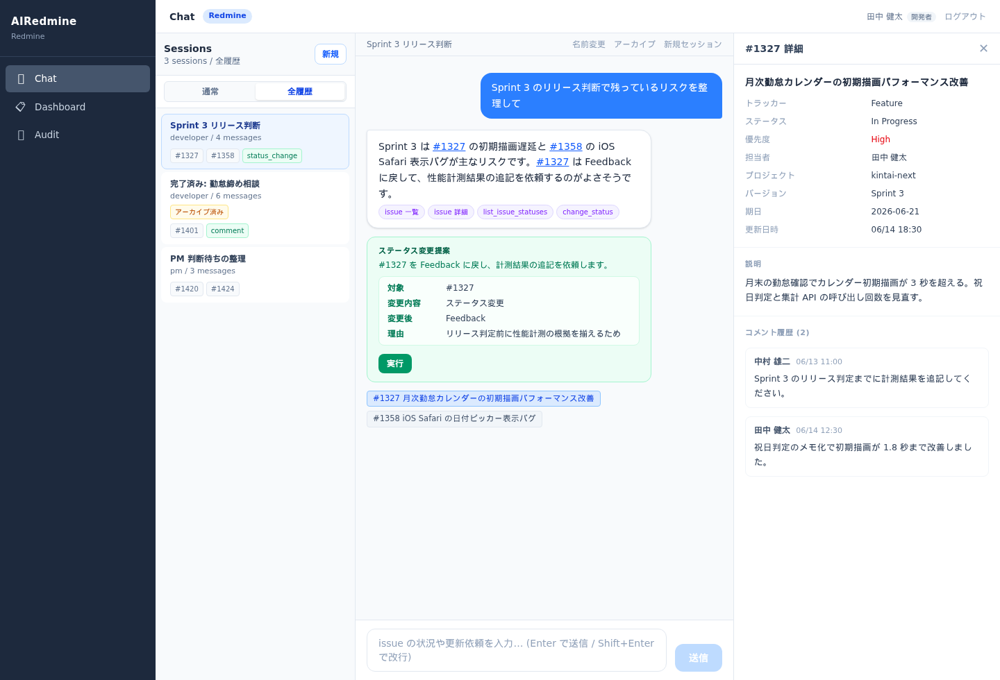
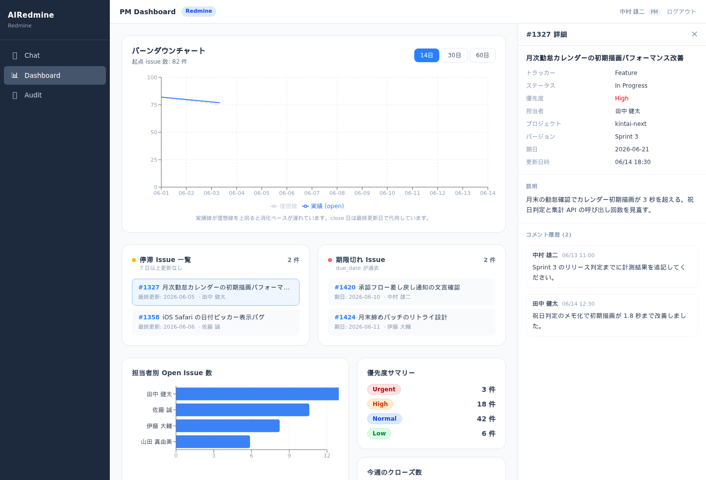
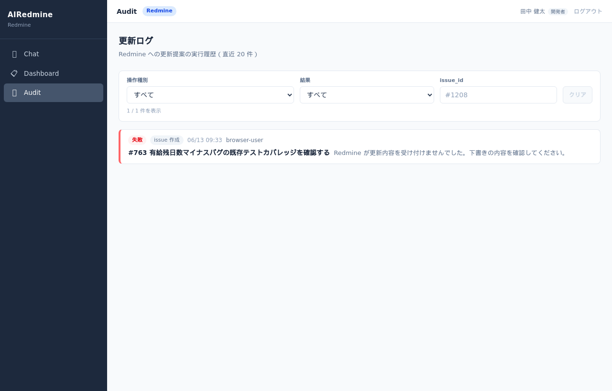

# AIRedmine

AIRedmine は、AI エージェントを通じて Redmine を利用する開発体験を試すためのプロトタイプです。

Redmine を活用したプロジェクトでは、issue、進捗、担当、判断履歴、リリース計画などが Redmine に集約されます。
今後の AI 駆動開発では、開発者や PM が Redmine を直接操作するだけでなく、AI エージェントを通じて Redmine の情報を読み、整理し、更新し、次の作業を決めることが増えると考えます。

このアプリの目的は、そのとき開発者や PM の体験がどう変化するか、どこが改善されるか、どんな不安や摩擦が残るかを体験できる形で明らかにすることです。

## ユーザー体験

AIRedmine が目指す体験は、Redmine を便利に見ることだけではありません。
Redmine に集約された issue、進捗、担当、判断履歴に加えて、設計ドキュメント、議事録、仕様書、PR、CI 結果、過去の意思決定などの知識ベースを AI エージェントが横断し、開発者や PM が次に判断・行動すべきことを分かるようにすることです。

### 開発者の体験

開発者は、朝に AIRedmine を開くと、Redmine の未完了チケット一覧を自分で読み解く代わりに、AI エージェントから今日の作業候補、優先理由、ブロッカー、確認すべき仕様を受け取ります。

- 今日取り組むべき issue を優先度・依存関係・更新状況から並べ替える。
- 長いコメント履歴や関連ドキュメントを要約する。
- ブロッカー、未回答質問、仕様の曖昧さを抽出する。
- 作業後に Redmine コメント、ステータス変更、担当変更、期日・優先度・進捗率・バージョン・関連付けの更新案を作り、確認後に反映する。
- 複数 issue のステータス変更・担当変更も、対象一覧と件数を確認してから一括更新する。
- キーワードだけでなく意味で issue を検索し、関連チケットを発見する。
- 相談トピックごとの Chat session を名前変更、アーカイブ、全履歴参照、通常一覧への復帰で整理する。



確認観点: Chat ではセッション切替、通常 / 全履歴の切替、アーカイブ済み session の復帰、`#NNN` からの issue 詳細パネル、更新 proposal の確認カードを代表状態として確認します。

### PM の体験

PM は、Redmine の一覧やガントチャートを細かく巡回する代わりに、AI エージェントからプロジェクトの兆候を受け取ります。

- 停滞している issue を検出する。
- PM の判断待ちになっている issue を集約する。
- 担当者ごとの負荷や優先度の偏りを要約する。
- 次の定例で話すべき議題を作る。



確認観点: PM Dashboard ではバーンダウン、停滞 issue、担当者別負荷、優先度サマリー、issue 詳細パネルを確認します。

### 人間が確認する境界

AIRedmine では、AI が勝手に Redmine を操作する体験を目指しません。
AI は情報収集・要約・更新案の作成を支援し、人間は判断・承認・クローズ・Redmine への反映を確認します。



確認観点: Audit では成功 / 失敗ログ、category、retryable、HTTP status、操作種別・結果・issue_id フィルタを確認します。

## View 構成

| View | URL | 対象 | 概要 |
| --- | --- | --- | --- |
| Chat | `/developer/chat` | 開発者・PM | Claude と対話しながら issue を探索・更新案を作成するスレッド型チャット。ログインロールで回答の切り口が変わる |
| Dashboard（開発者） | `/developer/dashboard` | 開発者 | 担当 issue をブロッカー・高優先度・その他の 3 セクションで表示。クリックで詳細（説明・コメント履歴）を表示 |
| Dashboard（PM） | `/pm/dashboard` | PM | バーンダウンチャート・停滞 issue・担当者別負荷・優先度サマリー・今週クローズ数・期限切れ issue を一覧 |
| Audit | `/audit` | 全員 | Redmine への更新提案の実行履歴を確認 |

## できること

- **ユーザー認証・ログイン**: JWT ベースのセッション管理。ロール（開発者/PM）はログイン時に決まり、UI での変更はできない
- **AI エージェントとの対話**: Claude (Haiku) が Redmine を自律的に検索・参照し、日本語で回答する
- **マークダウン回答**: 箇条書き・表・コードブロックを含む回答をレンダリング。`#NNN` はクリックで issue 詳細パネルを開く
- **チャットセッション**: 相談トピックごとにセッションを作成・切替・再開し、保存済み履歴を踏まえて会話を続けられる
- **セッション整理**: セッション名の変更、アーカイブ、通常 / 全履歴の切替、アーカイブ済み session の通常一覧への復帰ができる
- **マルチターン会話**: 同じセッション内の直近履歴を踏まえた連続した質問が可能
- **ロール別回答**: ログインロールで回答の切り口が変わる（開発者: 技術的優先順位・ブロッカー、PM: リスク・停滞・全体状況）
- **自分の issue を自動フィルタ**: 「私の今日の issue を教えて」でログインユーザーの担当 issue を自動参照
- **名前で担当者検索**: 「田中のissueを見せて」など、username または表示名で担当者を指定できる
- **意味検索**: キーワードが一致しなくても意味的に近い issue を発見できる（sentence-transformers）
- **Redmine への書き込み確認・実行**: issue 作成、コメント追加、ステータス変更、担当変更、期日・優先度・進捗率・バージョン・関連付け、一括更新を AI が提案し、人間が確認してから Redmine に反映
- **担当 issue 一覧と詳細確認**: Dashboard や Chat の `#NNN` リンクから issue 詳細パネルを開き、説明・コメント履歴・トラッカー・バージョン・更新日時を確認
- **更新監査**: Redmine への実行ログ、失敗時の category / retryable / HTTP status を Audit で確認
- **モックモード**: Redmine 未接続でも issue 一覧・詳細・更新確認フローを体験可能（Chat には `ANTHROPIC_API_KEY` が必要）

## アーキテクチャ

```text
ブラウザ (React + TypeScript + Vite, :5173)
        | /api/* proxy
        v
FastAPI バックエンド (:8000)
        |
        +--> Auth Layer (JWT / SQLite users テーブル)
        |
        +--> AI Agent (Anthropic API / Claude Haiku)
        |       +--> tool: list_issues
        |       +--> tool: get_issue
        |       +--> tool: search_issues          (キーワード検索)
        |       +--> tool: search_issues_semantic  (意味検索)
        |       +--> tool: list_projects          (project_id 参照)
        |       +--> tool: list_issue_statuses    (status_id 参照)
        |       +--> tool: list_priorities        (priority_id 参照)
        |       +--> tool: list_users             (user_id 参照)
        |       +--> tool: list_versions          (version_id 参照)
        |       +--> tool: add_comment            (確認待ちとして返す)
        |       +--> tool: change_status          (確認待ちとして返す)
        |       +--> tool: change_assignee        (確認待ちとして返す)
        |       +--> tool: bulk_update            (複数 issue の確認待ちとして返す)
        |       +--> tool: create_issue           (確認待ちとして返す)
        |       +--> tool: update_due_date        (確認待ちとして返す)
        |       +--> tool: update_priority        (確認待ちとして返す)
        |       +--> tool: update_done_ratio      (確認待ちとして返す)
        |       +--> tool: assign_version         (確認待ちとして返す)
        |       +--> tool: add_relation           (確認待ちとして返す)
        |       +--> tool: search_knowledge       (docs 検索)
        |
        +--> Redmine Connector (httpx)
        +--> Knowledge Base (docs/ 読み込み)
        +--> Semantic Index (SQLite + sentence-transformers)
        +--> Proposal & Audit Layer (差分表示 / 二段階確認 / 実行ログ / 再試行判断)
        +--> Chat Sessions (SQLite chat_sessions / conversations)
        +--> Experience Notes (SQLite)
        |
        v
OSS 版 Redmine (:3000)
```

- **frontend/**: React + TypeScript + Vite。Tailwind CSS v4 でスタイリング。
- **backend/**: Python + FastAPI。AI Agent は Anthropic API の tool_use ループで動作する。
- **Proposal & Audit Layer**: Redmine への書き込みは proposal として表示し、人間が確認してから実行する。Closed / Urgent / 過去日期日などの危険操作は二段階確認にする。
- **Chat Sessions**: 会話は相談トピック単位で保存する。同じ `session_id` の直近 10 messages / 6000 文字を AI 文脈に渡し、別セッションの履歴は混ぜない。`chat_sessions.archived_at` で通常一覧から隠し、全履歴表示や通常一覧への復帰で履歴を消さずに整理できる。
- **参照ツール**: Chat は project/status/priority/user/version の ID を推測せず、Redmine から取得した一覧に基づいて更新案を作る。
- **mcp-server/**: Redmine MCP サーバー。Claude Code から Redmine を直接操作できる（web アプリとは独立）。詳細は [`docs/mcp.md`](docs/mcp.md)。
- **Redmine**: `REDMINE_BASE_URL` / `REDMINE_API_KEY` が未設定の場合、モックデータで動作する。
- **AI**: `ANTHROPIC_API_KEY` が未設定の場合、Chat はエラーを返す。

## 起動

```bash
cp .env.example .env
# .env に REDMINE_API_KEY と ANTHROPIC_API_KEY を設定する
docker compose up
```

| サービス | URL |
| --- | --- |
| AIRedmine フロントエンド | `http://localhost:5173` |
| AIRedmine バックエンド API | `http://localhost:8000` |
| Redmine | `http://localhost:3000` |

### 初期ユーザーの作成

初回起動後、以下のコマンドで初期ユーザーを投入します。

```bash
docker compose exec backend python scripts/seed_users.py
```

| ユーザー名 | 表示名 | ロール |
| --- | --- | --- |
| tanaka | 田中 健太 | 開発者 |
| sato | 佐藤 誠 | 開発者 |
| ito | 伊藤 大輔 | 開発者 |
| yamada | 山田 真由美 | 開発者 |
| nakamura | 中村 雄二 | PM |
| admin | Redmine Admin | 開発者 |

パスワードは `.env` の `DEMO_PASSWORD`（デフォルト: `demo`）で全員共通です。

### モックモードで試す（Redmine 未接続）

`.env` の `REDMINE_BASE_URL` / `REDMINE_API_KEY` を未設定にすると、モックデータで issue 一覧・詳細を返します。
ただし Chat は Anthropic API を呼ぶため、`ANTHROPIC_API_KEY` は必要です。

### 実 Redmine に接続する

1. Redmine の管理画面で REST API を有効にする。
2. 個人設定から API キーを取得する。
3. `.env` に設定する。

```env
REDMINE_BASE_URL=http://localhost:3000
REDMINE_API_KEY=your-redmine-api-key
ANTHROPIC_API_KEY=sk-ant-your-api-key
```

1. バックエンドを再起動する。

```bash
docker compose restart backend
```

トップバーのバッジが「Redmine」になれば接続成功です。

### Redmine デモデータを投入する

ローカル Redmine に体験確認用の project と 510 件の issue を投入できます。

```bash
npm run seed:demo
```

同じコマンドを再実行すると、既存の `kintai-next` project / issue / user を再利用し、seed 定義に合わせて issue の説明、状態、優先度、コメント履歴を更新します。同じ本文のコメントは重複投入しません。

デモ中の操作で状態が大きく崩れた場合は、seed 用 project を作り直せます。

```bash
npm run seed:demo:reset
```

`seed:demo:reset` は Redmine 上の `kintai-next` project と配下の issue を削除してから再投入します。seed 用 project 以外をリセットする用途には使わないでください。

`seed:demo` / `seed:demo:reset` は投入後に semantic index も再構築します。seed だけ実行したい場合は `npm run seed:demo:no-index` を使えます。

初回投入後、出力された API キーを `.env` の `REDMINE_API_KEY` に設定してバックエンドを再起動します。

### デモで試す質問例

デモデータ投入後は、`kintai-next` project の Sprint 3 リリース判断、承認フロー、レポート性能、PM 判断待ちを材料に AIRedmine を試せます。

Chat では、次のような質問から始められます。

- 開発者: 「私の今日の issue を優先順に教えて」
- 開発者: 「承認フローまわりでブロッカーになっている issue は？」
- 開発者: 「#1327 月次勤怠カレンダーの初期描画パフォーマンスについて、これまでの議論を要約して」
- 開発者: 「#1358 iOS Safari の日付ピッカー表示バグの背景と次アクションを教えて」
- PM: 「Sprint 3 のリリース判断で残っているリスクは？」
- PM: 「PM 判断待ちの issue をまとめて」
- PM: 「期限切れ・停滞・Urgent をまとめて次の定例アジェンダにして」
- 意味検索: 「パフォーマンスが遅いという相談に関係する issue を探して」

セッションを試す場合は、1 つの相談トピックで続けて質問します。

- 「#1327 の背景を教えて」
- 続けて「その改善内容をレビュー観点で整理して」
- 別セッションを作り「Sprint 3 のリリース判断で残っているリスクは？」と聞き、セッションを切り替えて履歴が分かれることを確認する

更新提案と Audit を試す場合は、対象 issue を指定してから変更を依頼します。

- 「一括承認で一部が承認されないバグを報告する issue に、PM 確認待ちとコメントする提案を作って」
- 「#1327 の期日を 2026-07-01 にする提案を作って」
- 「#1327 の優先度を Urgent にする提案を作って」
- 「#1327 と #1358 を Feedback にする一括更新の提案を作って」

Proposal カードでは変更対象、変更後、理由、対象件数を確認できます。
Urgent、Closed、過去日期日、一括更新など影響が大きい操作は追加確認が必要です。
実行後は `/audit` で成功 / 失敗、category、retryable、HTTP status を確認できます。

Dashboard では、開発者として担当 issue の優先度とブロッカーを確認し、PM として担当者負荷、停滞 issue、期限切れ、優先度の偏りを確認します。
issue 行または Chat 回答内の `#NNN` をクリックすると、右側の詳細パネルで description、journals、tracker、version、updated_on を確認できます。

### 意味検索インデックスを構築する

seed を使わずに Redmine 側の issue を大きく変更した場合は、手動でインデックスを再構築します。

```bash
curl -X POST http://localhost:8000/api/ai/index/build
# → {"indexed_issues": 517, "ready": true}
```

再構築が必要なとき（チケットが大幅に増えた場合など）も同じコマンドを実行します。

意味検索の代表質問セットを評価する場合は、次のコマンドで top 5 を Markdown 出力できます。

```bash
npm run eval:semantic
```

### ヘルスチェック

```bash
curl http://localhost:8000/health
curl http://localhost:8000/api/ai/health      # Anthropic API 疎通確認
curl http://localhost:8000/api/ai/index/status  # 意味検索インデックスの状態
curl http://localhost:8000/api/ai/index/freshness  # Redmine との鮮度差分
```

## 開発

ソースを変更すると Vite（フロントエンド）と uvicorn（バックエンド）が自動でリロードします。

```bash
docker compose up
docker compose logs -f frontend backend
docker compose exec backend python -m pytest tests/ -v
```

### スクリーンショット更新

README / docs で参照する代表画面のスクリーンショットは、固定レスポンスの撮影データで再生成できます。
初回は Playwright のブラウザを用意します。

```bash
npm install
npx playwright install chromium
npm run screenshots
```

`npm run screenshots` は一時的に `http://127.0.0.1:5174` で frontend dev server を起動し、次の 3 枚を更新します。

- `docs/screenshots/developer-chat.png`
- `docs/screenshots/pm-dashboard.png`
- `docs/screenshots/audit-view.png`

既に起動している frontend を使う場合は、URL を指定できます。

```bash
npm run screenshots -- --app-url http://localhost:5173
```

### 環境変数

| 変数 | 説明 | デフォルト |
| --- | --- | --- |
| `REDMINE_BASE_URL` | 接続先 Redmine の URL | （未設定 → モック） |
| `REDMINE_API_KEY` | Redmine API キー | （未設定 → モック） |
| `ANTHROPIC_API_KEY` | Anthropic API キー（Chat に必要） | （未設定 → Chat エラー） |
| `DEMO_PASSWORD` | 全ユーザー共通パスワード | `demo` |
| `JWT_SECRET` | JWT 署名シークレット | `change-me-in-production` |
| `DOCS_ROOT` | ナレッジベースの読み込み先 | `/project` |
| `DB_PATH` | SQLite DB のパス | `/app/data/airedmaine.db` |
| `BACKEND_URL` | フロントエンドからバックエンドへのプロキシ先 | `http://backend:8000` |

## 開発ドキュメント

- `CLAUDE.md`: 共同開発ルール
- `docs/roadmap.md`: 現在進行中のロードマップ
- `docs/roadmaplog.md`: 終了したマイルストーンと変更履歴
- `docs/issues.md`: issue 管理
- `docs/issueslog.md`: issue の検討ログ
- `docs/spec.md`: 要求・機能・テスト仕様
- `docs/architecture.md`: 現在の構成・責務・主要データフロー
- `docs/chat-sessions.md`: チャットセッションの体験要件と実装方針
- `docs/semantic-embedding-scope.md`: 意味検索の embedding 対象と freshness 方針
- `docs/performance.md`: API / frontend の計測結果とボトルネック分析
- `docs/mcp.md`: Redmine MCP サーバーの接続手順

## 参考

- [Redmine REST API](https://www.redmine.org/projects/redmine/wiki/Rest_api)
- [Anthropic API](https://docs.anthropic.com)
- [FastAPI](https://fastapi.tiangolo.com)
- [React + Vite](https://vite.dev)
- [sentence-transformers](https://www.sbert.net)
