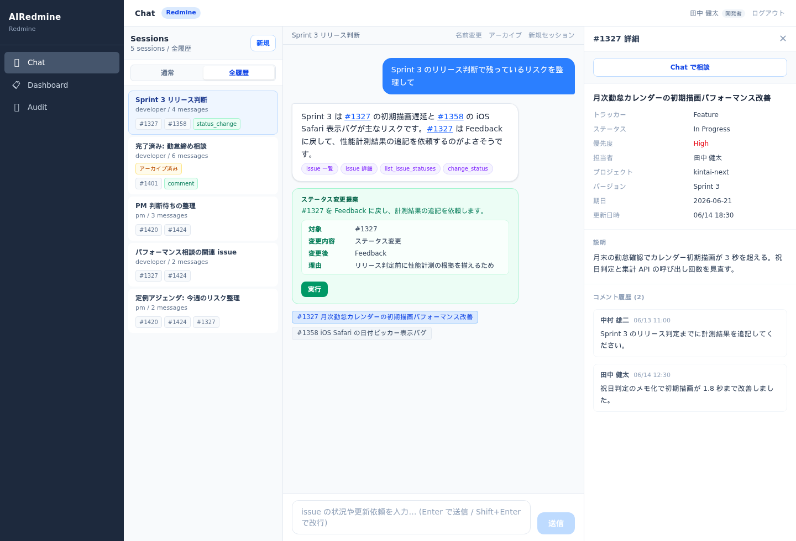
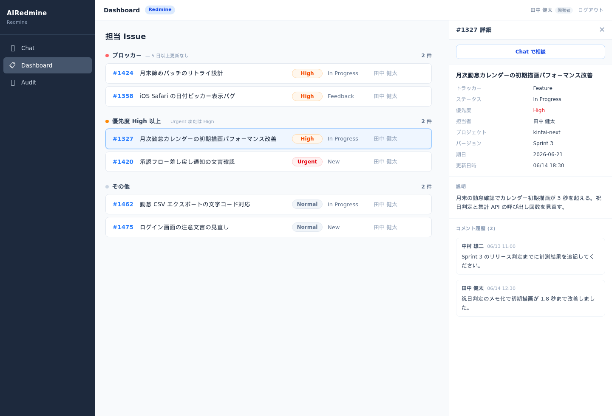
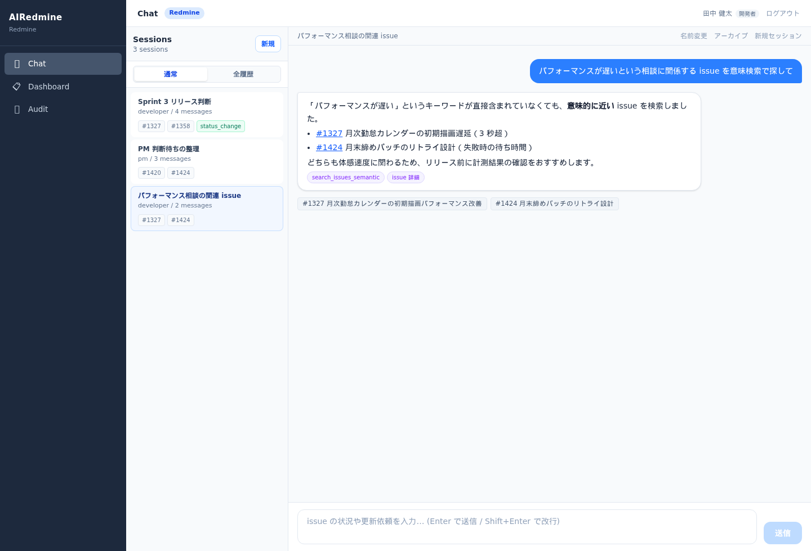
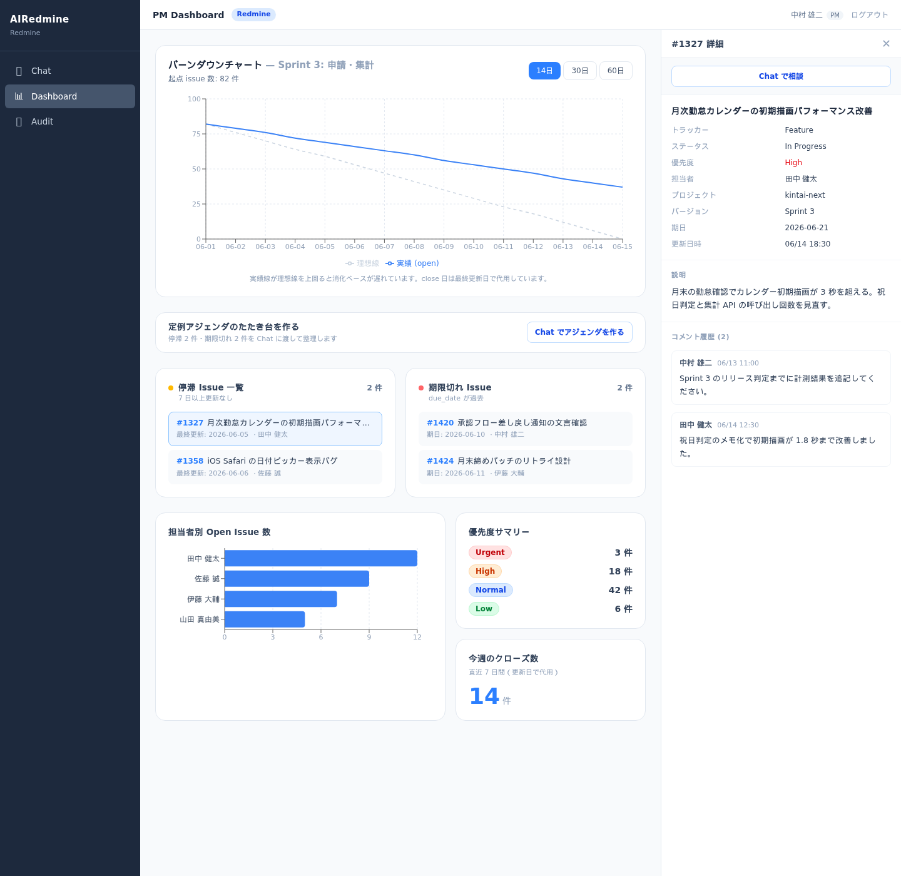
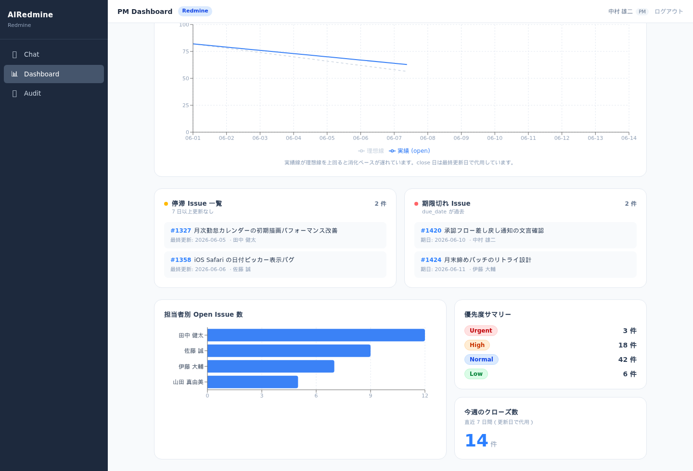
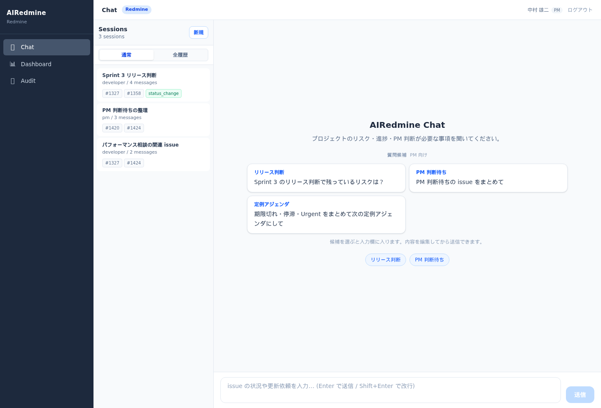
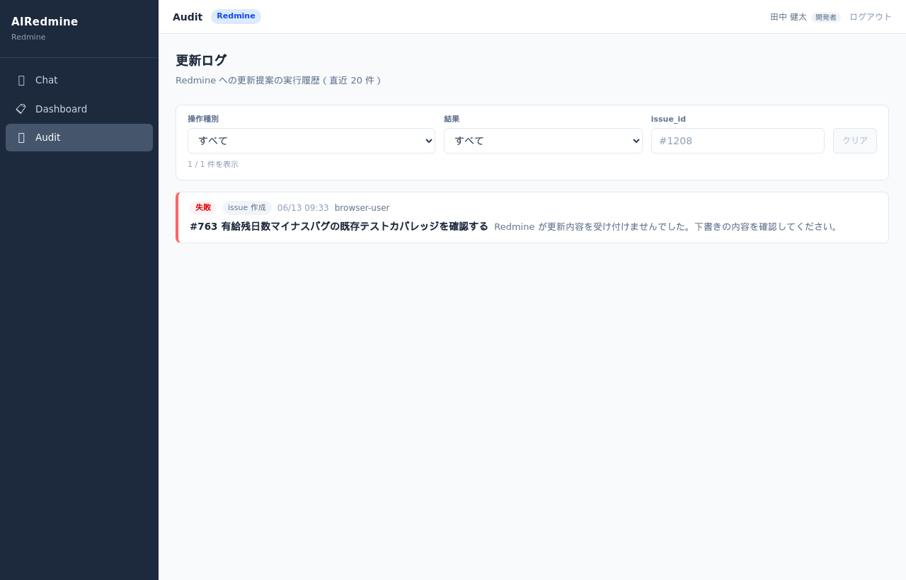

# AIRedmine

AIRedmine は、AI エージェントを通じて Redmine を利用する開発体験ができるプロトタイプです。

今後の AI 駆動開発では、開発者や PM が Redmine を直接操作するだけでなく、AI エージェントを通じて Redmine の情報を読み、整理し、更新し、次の作業を決めることが増えると考えます。

このアプリの目的は、そのとき開発者や PM の体験がどう変化するか、どこが改善されるか、どんな不安や摩擦が残るかを体験できる形で明らかにすることです。

尚、Redmineの代わりに同様なプロジェクト管理ツール（backlog, jira等）＋AIエージェントでも同様の体験が可能になる想定です。


## ユーザー体験

AIRedmine が目指す体験は、Redmine を便利に見ることだけではありません。Redmine に集約された issue、進捗、担当、判断履歴に加えて、設計ドキュメント、議事録、仕様書、PR、CI 結果、過去の意思決定などの知識ベースを AI エージェントが横断し、開発者や PM が次に判断・行動すべきことを分かるようにすることです。

### 開発者の体験

開発者は、朝に AIRedmine を開くと、AI エージェントから今日の作業候補、優先理由、ブロッカー、確認すべき仕様を受け取ります。AIエージェントとの対話（チャット）を通じて、必要な情報取得したり更新指示を出すことができます。

- 今日取り組むべき issue を優先度・依存関係・更新状況から並べ替える。
- 長いコメント履歴や関連ドキュメントを要約する。
- ブロッカー、未回答質問、仕様の曖昧さを抽出する。
- 作業後に Redmine コメント、ステータス変更、担当変更、期日・優先度・進捗率・バージョン・関連付けの更新案を作り、確認後に反映する。
- 複数 issue のステータス変更・担当変更も、対象一覧と件数を確認してから一括更新する。
- キーワードだけでなく意味で issue を検索し、関連チケットを発見する。
- 相談トピックごとの Chat session を名前変更、アーカイブ、全履歴参照、通常一覧への復帰で整理する。



確認観点: Chat ではセッション切替、通常 / 全履歴の切替、アーカイブ済み session の復帰、`#NNN` からの issue 詳細パネル、更新 proposal の確認カードを代表状態として確認します。



確認観点: 開発者 Dashboard では担当 issue をブロッカー（5 日以上更新なし）・優先度 High 以上・その他に分類し、行クリックで issue 詳細パネルを開けることを確認します。



確認観点: 意味検索では「パフォーマンスが遅い」のようにキーワードが直接一致しなくても、意味的に近い issue を発見できることを確認します。

### PM の体験

PM は、Redmine の一覧やガントチャートをPM自ら細かく巡回する代わりに、AI エージェントからプロジェクトの兆候をダッシュボードから受け取ります。

- 停滞している issue を検出する。
- PM の判断待ちになっている issue を集約する。
- 担当者ごとの負荷や優先度の偏りを要約する。
- 次の定例で話すべき議題を作る。



確認観点: PM Dashboard ではバーンダウン、停滞 issue、担当者別負荷、優先度サマリー、issue 詳細パネル、リスクから Chat で定例アジェンダを作る導線を確認します。



確認観点: 統計部では停滞 issue、期限切れ issue、担当者別 Open Issue 数、優先度サマリー、今週のクローズ数を確認します。



確認観点: PM の Chat 空状態では PM 向けの質問候補（リリース判断・PM 判断待ち・定例アジェンダ）から相談を始められることを確認します。

### 人間が確認する境界

AIRedmine では、AI が勝手に Redmine を操作する体験を目指しません。
AI は情報収集・要約・更新案の作成を支援し、人間は判断・承認・クローズ・Redmine への反映を確認します。Redmineを更新した操作の証跡は記録され確認が可能です。



確認観点: Audit では成功 / 失敗ログ、category、retryable、HTTP status、操作種別・結果・issue_id フィルタを確認します。

## View 構成

| View | URL | 対象 | 概要 |
| --- | --- | --- | --- |
| Chat | `/developer/chat` | 開発者・PM | Claude と対話しながら issue を探索・更新案を作成するスレッド型チャット。ログインロールで回答の切り口が変わる |
| Dashboard（開発者） | `/developer/dashboard` | 開発者 | 担当 issue をブロッカー・高優先度・その他の 3 セクションで表示。クリックで詳細（説明・コメント履歴）を表示 |
| Dashboard（PM） | `/pm/dashboard` | PM | バーンダウンチャート・停滞 issue・担当者別負荷・優先度サマリー・今週クローズ数・期限切れ issue を一覧 |
| Audit | `/audit` | 全員 | Redmine への更新提案の実行履歴を確認 |

## できること

- **ユーザー認証・ログイン**: JWT ベースのセッション管理。ロール（開発者/PM）はログイン時に決まり、UI での変更はできない
- **AI エージェントとの対話**: Claude (Haiku) が Redmine を自律的に検索・参照し、日本語で回答する
- **マークダウン回答**: 箇条書き・表・コードブロックを含む回答をレンダリング。`#NNN` はクリックで issue 詳細パネルを開く
- **チャットセッション**: 相談トピックごとにセッションを作成・切替・再開し、保存済み履歴を踏まえて会話を続けられる
- **質問候補**: Chat の空状態でロール別の質問候補を表示し、選んだ候補を編集してから送信できる
- **セッション整理**: セッション名の変更、アーカイブ、通常 / 全履歴の切替、アーカイブ済み session の通常一覧への復帰ができる
- **マルチターン会話**: 同じセッション内の直近履歴を踏まえた連続した質問が可能
- **ロール別回答**: ログインロールで回答の切り口が変わる（開発者: 技術的優先順位・ブロッカー、PM: リスク・停滞・全体状況）
- **自分の issue を自動フィルタ**: 「私の今日の issue を教えて」でログインユーザーの担当 issue を自動参照
- **名前で担当者検索**: 「田中のissueを見せて」など、username または表示名で担当者を指定できる
- **意味検索**: キーワードが一致しなくても意味的に近い issue を発見できる（sentence-transformers）
- **Redmine への書き込み確認・実行**: issue 作成、コメント追加、ステータス変更、担当変更、期日・優先度・進捗率・バージョン・関連付け、一括更新を AI が提案し、人間が確認してから Redmine に反映
- **担当 issue 一覧と詳細確認**: Dashboard や Chat の `#NNN` リンクから issue 詳細パネルを開き、説明・コメント履歴・トラッカー・バージョン・更新日時を確認
- **更新監査**: Redmine への実行ログ、失敗時の category / retryable / HTTP status を Audit で確認
- **スプリントバーンダウン**: PM Dashboard のバーンダウンを進行中スプリント（期日が最も近い open version）に絞り、残作業の消化ペースを可視化
- **定例アジェンダ導線**: PM Dashboard の停滞・期限切れ issue から、対象件数・代表 issue ID 入りのアジェンダ文を Chat に渡して整理できる
- **Redmine MCP サーバー**: Claude Code などの MCP クライアントから Redmine を操作できる（web アプリとは独立）。stdio と、ステートレス HTTP + JWT 認証の共有エンドポイント（`X-Redmine-Switch-User` で本人操作）を選べる。`MCP_SERVER_URL` を設定すると backend の Redmine 参照・操作も MCP に一本化できる。詳細は [`docs/mcp.md`](docs/mcp.md)
- **モックモード**: Redmine 未接続でも issue 一覧・詳細・更新確認フローを体験可能（Chat には `ANTHROPIC_API_KEY` が必要。`MCP_SERVER_URL` 未設定時のみ）

## アーキテクチャ

Redmine への入口は独立した 2 経路。どちらも最終的に同じ Redmine を操作する。

```text
経路A: web アプリ
  ブラウザ (React/Vite, :5173) --/api/*--> FastAPI backend (:8000) --> Redmine (:3000)
      backend: AI Agent (Claude Haiku, tool_use・20 ツール) / Semantic Index /
               Knowledge (docs/) / PM Analytics / Proposal & Audit / Chat Sessions (SQLite)

経路B: MCP 連携（web アプリとは独立）
  MCP クライアント (Claude Code 等) --MCP(stdio/HTTP)--> MCP サーバー (:8848) --> Redmine (:3000)
      stdio: ローカル単一ユーザー / http: ステートレス HTTP + JWT 認証（本人操作）
```

- **frontend/**: React + TypeScript + Vite（Tailwind CSS v4）。
- **backend/**: Python + FastAPI。AI Agent は Anthropic の tool_use ループで動く。書き込みは proposal として提示し、人間が承認してから実行する（Closed / Urgent / 過去日期日は二段階確認）。PM バーンダウンは進行中スプリントに絞って表示する。
- **mcp-server/**: Redmine MCP サーバー（独立）。stdio と、JWT 認証つきステートレス HTTP の共有エンドポイント（`X-Redmine-Switch-User` で本人操作）。詳細は [`docs/mcp.md`](docs/mcp.md)。
- **AI**: `ANTHROPIC_API_KEY` が未設定なら Chat はエラー。

## クイックスタート

以下の手順で、AIエージェントとRedmine（架空プロジェクトのチケットが登録されたもの）による開発体験を試すことができます。

### 1. リポジトリを取得する

```bash
git clone git@github.com:hidyon/airedmine.git
cd airedmine
```

### 2. 設定ファイルを記入する

```bash
cp .env.example .env
# .env に ANTHROPIC_API_KEY を設定する（Chat に必要）
# REDMINE_API_KEY は空のままでよい（この後 step 4 で発行されるキーを step 5 で設定する）
```

### 3. Docker を起動する

```bash
docker compose up
```

| サービス | URL |
| --- | --- |
| AIRedmine フロントエンド | `http://localhost:5173` |
| AIRedmine バックエンド API | `http://localhost:8000` |
| Redmine | `http://localhost:3000` |

### 4. 初期データを投入する

初期ユーザーと、実 Redmine 体験用のデモ issue（`kintai-next` project）を投入します。

```bash
docker compose exec backend python scripts/seed_users.py   # ログインユーザー
npm run seed:demo:no-index                                 # Redmine デモ issue（意味検索インデックスは step 5 で作る）
```

`seed:demo:no-index` の出力に Redmine API キーが表示されます。step 5 で使います。

### 5. 実 Redmine に接続して意味検索を有効にする

step 4 で出力された API キーを `.env` の `REDMINE_API_KEY` に設定し、バックエンドを再起動してから意味検索インデックスを構築します。

```bash
# .env の REDMINE_API_KEY=＜step 4 で出力されたキー＞ を設定してから：
docker compose restart backend
curl -X POST http://localhost:8000/api/ai/index/build
# → {"indexed_issues": 517, "ready": true}
```

> ⚠️ 意味検索インデックスは **REDMINE_API_KEY を設定してバックエンドを再起動した後**に構築します。順序を逆にすると空のインデックスになり、意味検索がデモ issue に対して効きません。
> `REDMINE_API_KEY` を空のままにするとモックデータで動作します（Chat は動きますが、意味検索はデモ issue には効きません）。

### 6. ログインする

`http://localhost:5173` を開き、以下でログインします（パスワードは全員 `.env` の `DEMO_PASSWORD`、デフォルト `demo`）。

| ユーザー名 | ロール |
| --- | --- |
| tanaka | 開発者 |
| nakamura | PM |

### 7. 試してみる

Chat で次のように聞いてみます。

- 開発者（tanaka）: 「私の今日の issue を優先順に教えて」
- PM（nakamura）: 「Sprint 3 のリリース判断で残っているリスクは？」
- 意味検索: 「パフォーマンスが遅いという相談に関係する issue を探して」

回答内の `#1327` などをクリックすると issue 詳細パネルが開きます。
「#1327 の期日を 2026-07-01 にする提案を作って」のように依頼すると更新 proposal が作られ、確認後の実行結果は `/audit` で確認できます。

その他の質問例やモックモード・実 Redmine 接続・意味検索インデックス・ヘルスチェックの詳細は [`docs/`](docs/) を参照してください。
